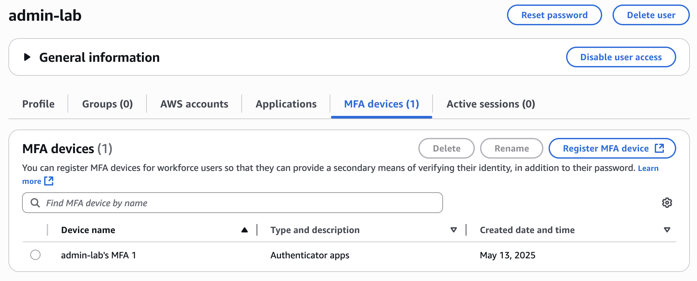
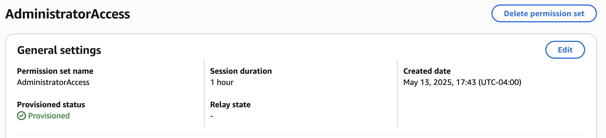

# Module 1: IAM Identity Center and IAM Security Foundations

## 📘 Objective
Implement identity controls including MFA for the root user, enabling AWS IAM Identity Center, and assigning permissions using best practices from the AWS Well-Architected Framework.

---

## ✅ Steps Completed

### Step 1.1 – Enable MFA for Root User
- 🔒 Logged into AWS Console as root user
- Navigated to `Security Credentials`
- Assigned a **Virtual MFA device** using Google Authenticator
- Verified MFA status = **Assigned**

📝 **Notes**:
- Backup codes saved securely
- Root user now requires MFA for login

---

### Step 1.2 – Enable AWS IAM Identity Center
- 🧭 Enabled IAM Identity Center via AWS Console
- Chose default identity source

📝 **Notes**:
- For production, a directory like Okta or AD would be better
- No additional users or groups exist yet

---

### Step 1.3 – Create Admin User
- 👤 Created user: admin-lab
- Skipped group assignment (handled later)

---

### Step 1.4 – Set up MFA for Admin User
- Registered MFA using Authenticator App
- Verified MFA enforcement on login

---

### Step 1.5 – Create Permission Sets
- 🛡️ Created `AdministratorAccess` and `ReadOnlyAccess` permission sets

📝 **Notes**:
- Used AWS Predefined permission sets
- Documented naming conventions

---

### Step 1.6 – Assign Users to AWS Account
- Assigned `admin` user with `AdministratorAccess` to root AWS account

---

### Step 1.7 – Set Up IAM Access Analyzer
- Created analyzer named `AccountAnalyzer`
- Scope: current AWS account

---

## 📸 Screenshots

### ✅ MFA Enabled for Admin User

---

#### ✅ AdministratorAccess Permission Set

---

## 💡 Lessons Learned
- Importance of separating identity management from root access
- IAM Identity Center is easier to manage than traditional IAM for orgs with many users
- Enforcing MFA at multiple levels adds strong security

---

## 🔗 Resources
- [AWS IAM Identity Center Documentation](https://docs.aws.amazon.com/singlesignon/latest/userguide/what-is.html)
- [MFA Best Practices](https://docs.aws.amazon.com/IAM/latest/UserGuide/id_credentials_mfa.html)