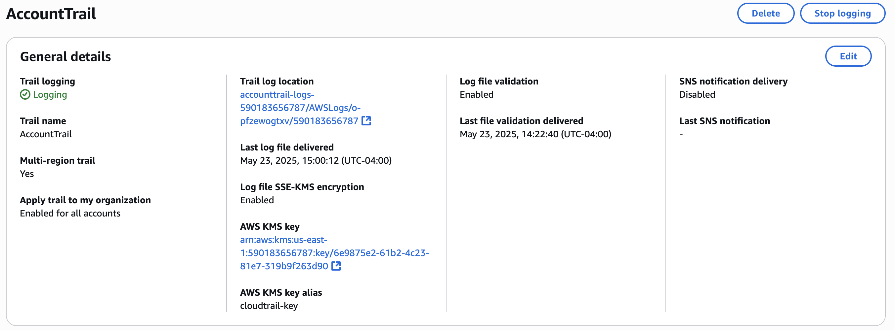

# Module 2: CloudTrail Logging and Monitoring

## 📘 Objective  
Implement AWS CloudTrail to log management activity, secure log storage in S3, and set up CloudWatch alarms for sensitive changes using best practices.

---

## ✅ Steps Completed

### Step 2.1 – Enable CloudTrail  
- Trail Name: `AccountTrail`
- Log Destination: `accounttrail-logs-590183656787`
- Includes management events  
📝 *Confirmed logs delivered to S3*

### Step 2.2 – Secure S3 Bucket  
- Block Public Access: All enabled ✅  
- Bucket Policy restricts access to `cloudtrail.amazonaws.com` with `SourceArn`  
📝 *Scoped to org and account log folders*

### Step 2.3 – Create Metric Filter  
- Log Group: `/aws/cloudtrail/AccountTrailLogs`
- Filter Pattern: `{ $.eventSource = "iam.amazonaws.com" && $.eventName = "CreateUser" }`  
- Metric Name: `CloudTrailCreateUser` (namespace: `CloudTrailCustom`)  

### Step 2.4 – Trigger CloudTrail Event  
- Created test IAM user: `cloudtrail-test-user`  
📝 *Deleted after logs confirmed*

### Step 2.5 – Create Alarm  
- Alarm Name: `CloudTrailCreateUserAlarm`  
- Threshold: ≥ 1 in 5 minutes  
- SNS Topic: `SecurityAlerts`  
📝 *Email notification tested and confirmed*

---

## 📸 Screenshots

---

## 🧠 Notes
- Metric won't show in CloudWatch until an event is triggered
- SNS topic requires email confirmation to function
