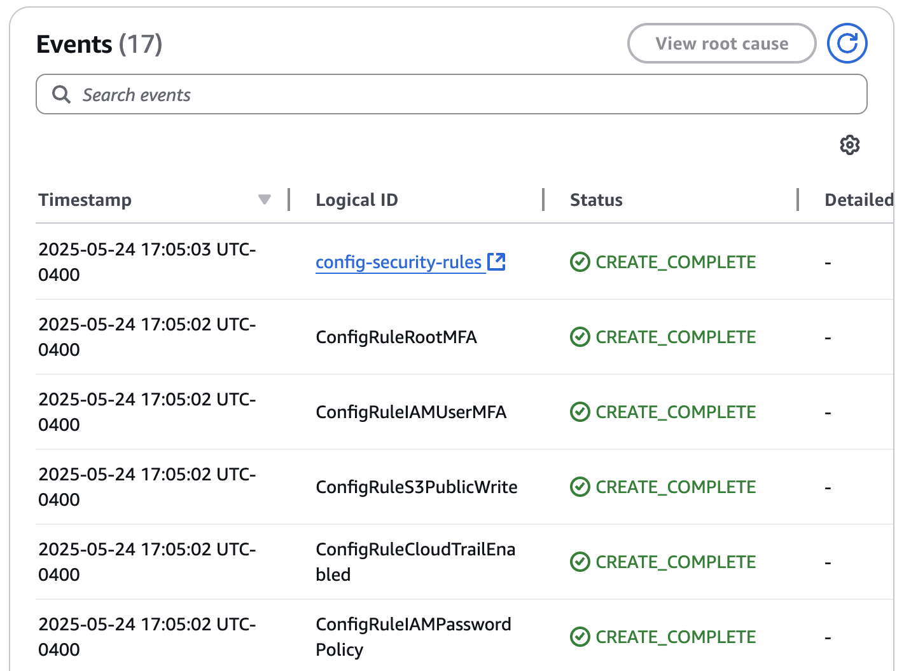

# Module 3: AWS Config and Compliance

## 📘 Objective  
Enable AWS Config for continuous compliance monitoring and deploy foundational compliance rules using CloudFormation.

---

## ✅ Steps Completed

### Step 3.1 – Enable AWS Config
- Resource Recording: All supported resources in region  
- Global Resources: Included ✅  
- Delivery Method: New S3 bucket created (`config-bucket-[account-id]`)  
- SNS Topic: Created and enabled (`ConfigAlerts`)  
📝 *Confirmed Config is recording and notifications are active*

### Step 3.2 – Deploy Config Rules via CloudFormation
- Stack Name: `config-security-rules`  
- Template File: [`account-governance.yaml`](https://github.com/ajy0127/grc_portfolio/blob/main/labs/lab-1-account-governance/code/cloudformation/account-governance.yaml)  
- Stack Status: `CREATE_COMPLETE`  
📝 *Deployed AWS Config Rules:*  
  – IAM Password Policy check  
  – Root account MFA check  
  – IAM User MFA check  
  – CloudTrail enabled check  
  – S3 bucket public write protection check

---

## 📸 Screenshots

---

## 🧠 Notes  
- CloudFormation automates consistent rule deployment  
- Ensure SNS subscription is confirmed to receive alerts  
- Rules support continuous security posture monitoring
